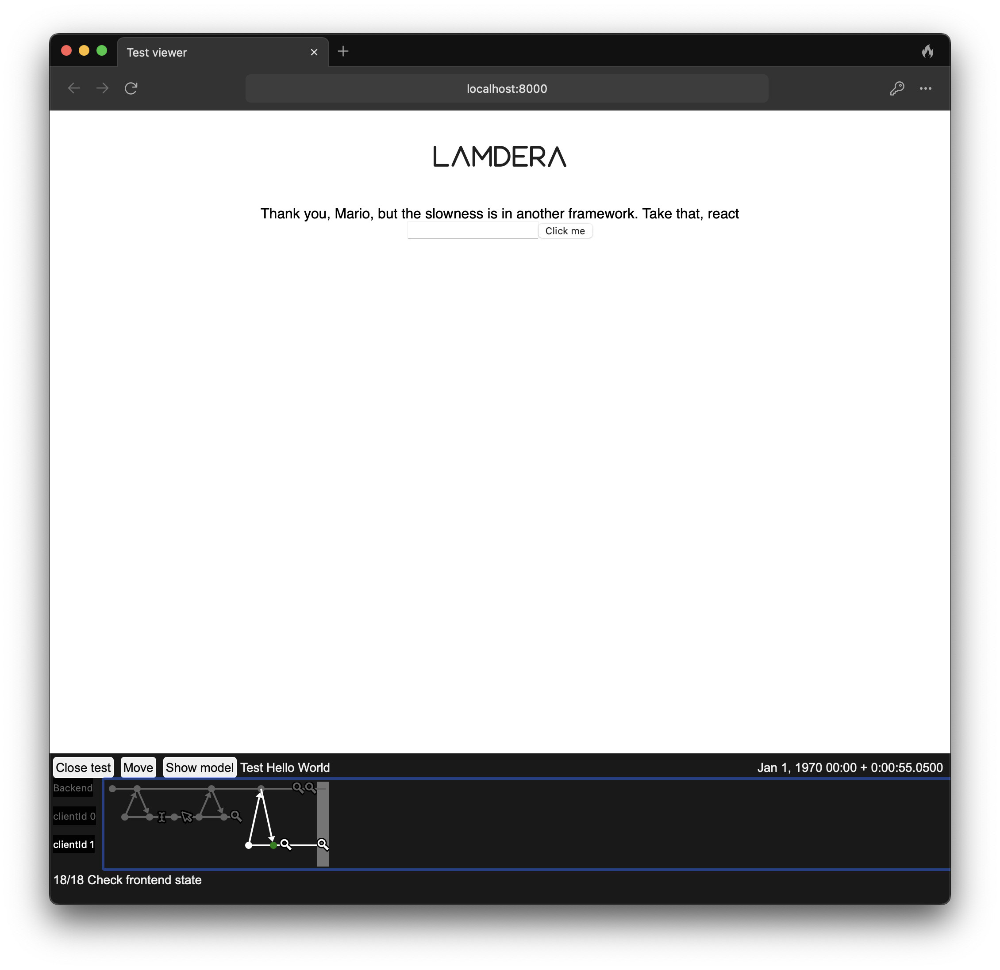

🚀 Lamdera Program-Test Boilerplate

Welcome to the ultimate starter kit for writing end-to-end tests in Lamdera with program-test!
Want to test everything — from user clicks to backend logic? You're in the right place. 🔍🧪

⸻

🧠 Analysis – What is program-test?

program-test is a powerful end-to-end testing framework for Lamdera.
But here's the twist: no black magic, no browser automation — just pure Elm 💚
And yes, you can actually see your tests run.

⸻

🎯 Design – The Key Insight 🧩

👉 A program-test is just a regular Elm test.
No need to treat it like a separate beast.

✅ Run it like any other test:

```
elm-test-rs --compiler lamdera
```

✅ It integrates perfectly into your existing test suite 🧵

⸻

🛠️ Development – Watch Your Tests in Action 🎬

Here's where program-test shines: you can see everything your test does.
It's like an interactive replay of your app under test.
1. Start the Lamdera dev server:

```
lamdera live
```

2. Open your browser at:

```
http://localhost:8000/tests/TestsRunner.elm
```

🖼️ There, you can:
- Watch your tests step by step
- See what the user would see
- Debug layout or rendering issues easily

⸻

🚀 Implementation – Getting Started 🧪
1. ✍️ Write your tests in the tests folder (start from HelloWorldTest.elm)
2. 🧩 Import them in tests/Tests.elm
3. 🧪 Run them with:

```
elm-test-rs --compiler lamdera
```

4. 👀 View them visually at: http://localhost:8000/tests/TestsRunner.elm

⸻

🧑‍🏫 Example Test

Here's a typical end-to-end test:
```elm
helloWorldTest : TF.EndToEndTest ToBackend FrontendMsg FrontendModel ToFrontend BackendMsg BackendModel
helloWorldTest =
    TF.start "Test Hello World"
        (Time.millisToPosix 0)
        config
        [ TF.connectFrontend
            100
            (sessionIdFromString "session1")
            "/"
            { width = 900, height = 800 }
            (\client ->
                [ client.input 100 (Dom.id "best-framework") "react"
                , client.click 100 (Dom.id "save-the-world")
                , client.checkView
                    100
                    (Test.Html.Query.has
                        [ Test.Html.Selector.text "Thank you, Mario, but the slowness is in another framework"
                        , Test.Html.Selector.text "Take that, react"
                        ]
                    )
                ]
            )
        ]
```

⸻

✅ Why It Rocks

🌍 Complete testing: From UI to backend, everything's covered
🕵️‍♂️ Visual verification: See exactly what your users will see 
🧘 Peace of mind: Know it works before you deploy
⚡ Blazing fast: Pure Elm = Pure functions = Faster than 

⸻

📈 What's Next? 🎉

Explore the example tests, duplicate them, tweak them, break things and watch them break beautifully 😄
You'll be building robust apps with joy, and it shows.

⸻

💡 Pro Tip: Program-tests are so fast and fun you might find yourself addicted. Don't say we didn't warn you. 😉

⸻

Want help writing your first test, or want a custom one crafted just for you? Just say the word 💬
